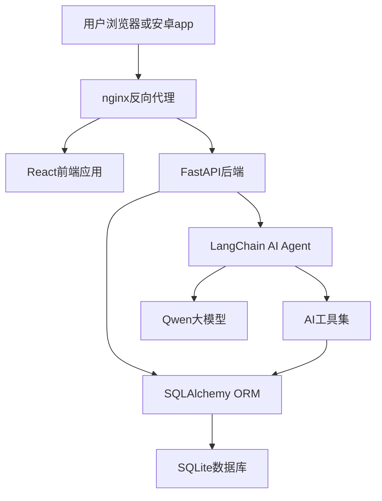
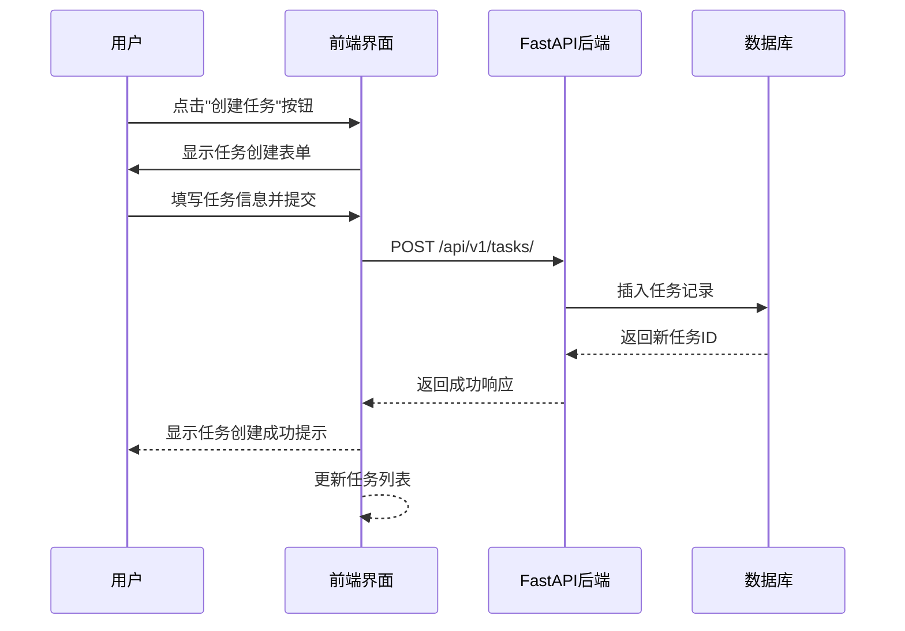
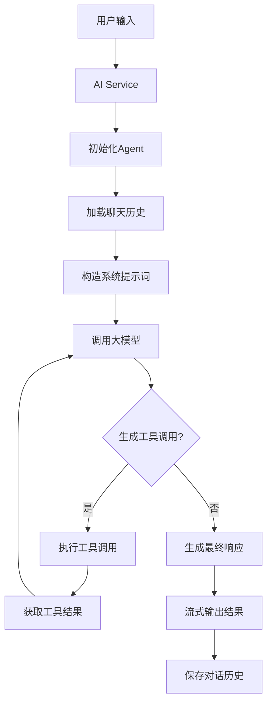
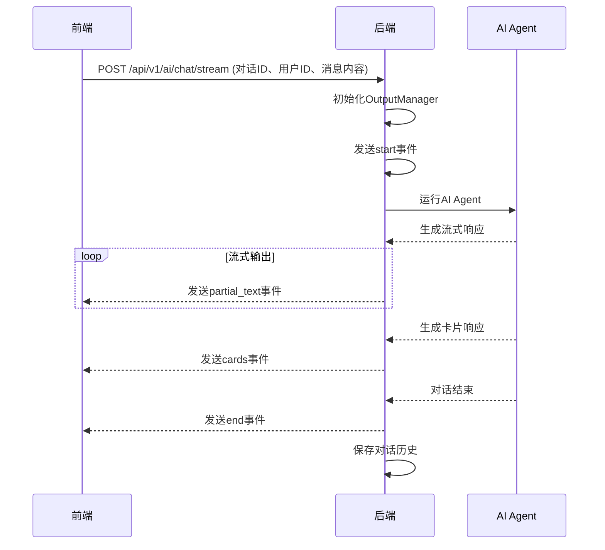
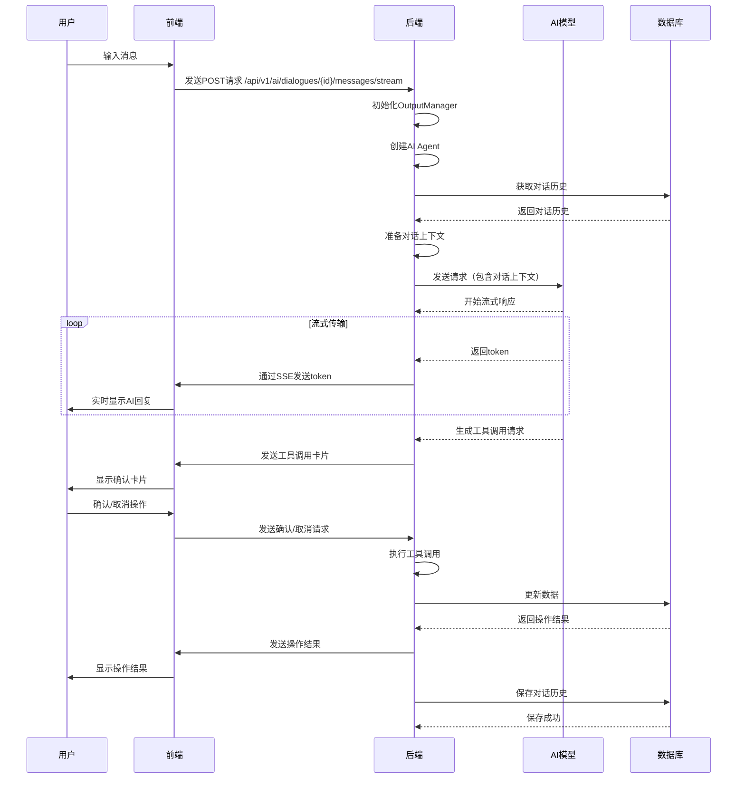
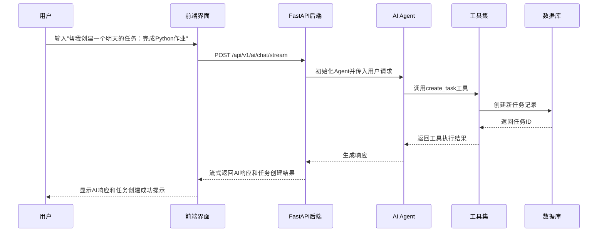

# Task Stream 项目报告

## 第一部分 概述

### 1.1 作品概述、功能

Task Stream 是一款集任务管理、长期目标规划、每日日志和AI智能助手于一体的综合生产力工具，旨在帮助用户高效管理日常任务、追踪长期目标并通过AI助手提供智能支持。

**核心功能包括：**

- 任务管理：创建、编辑、删除和追踪日常任务
- 长期目标规划：设置和管理长期任务，支持子任务关联和进度跟踪
- 每日日志：记录和查看每日日志，支持Markdown格式
- AI智能助手：提供智能对话、任务管理建议和自动化操作
- 数据可视化：通过热力图展示任务完成情况
- 自定义主题：支持个性化主题样式设置
- 响应式设计：适配桌面和移动端

### 1.2 作品可行性分析和目标群体

#### 技术可行性

- **前端**：基于React构建，采用组件化设计，支持响应式布局
- **后端**：使用FastAPI框架，支持异步处理和高效API请求
- **数据库**：采用SQLite，适合轻量级应用，易于部署
- **AI集成**：支持OpenAI兼容API，可灵活配置不同AI模型
- **移动端**：使用Capacitor框架，可打包为Android应用

#### 市场前景

- 生产力工具市场持续增长，用户对任务管理和时间规划需求旺盛
- AI助手的加入提升了产品的智能化水平，增强了竞争力
- 多端同步和响应式设计满足了用户在不同设备上的使用需求

#### 目标群体

- 学生：用于管理学习任务和长期项目
- 职场人士：用于规划工作任务和项目进度
- 自由职业者：用于管理客户项目和个人目标
- 任何需要提高生产力和时间管理能力的用户

### 1.3 整体架构设计

Task Stream采用前后端分离架构，主要分为以下几个层次：



## 第二部分 功能实现

### 2.1 数据结构以及路由设计

#### 数据结构

**用户表 (users)**

- id: 用户ID
- username: 用户名
- passwordHash: 密码哈希
- name: 姓名
- created_at: 创建时间

**任务表 (tasks)**

- id: 任务ID
- user_id: 用户ID
- title: 任务标题
- description: 任务描述
- status: 任务状态 (0: 未开始, 1: 待办, 2: 进行中, 3: 完成)
- due_date: 截止日期
- created_at: 创建时间
- updated_at: 更新时间
- assigned_date: 分配日期
- assigned_start_time: 开始时间
- assigned_end_time: 结束时间
- tags: 标签
- record_result: 是否记录结果
- result: 任务结果
- result_picture_url: 结果图片URL
- long_term_task_id: 关联的长期任务ID

**长期任务表 (long_term_tasks)**

- id: 长期任务ID
- user_id: 用户ID
- title: 任务标题
- description: 任务描述
- start_date: 开始日期
- due_date: 截止日期
- progress: 进度 (0.0-1.0)
- created_at: 创建时间
- sub_task_ids: 子任务ID及权重

**日志表 (journals)**

- date: 日期
- user_id: 用户ID
- content: 日志内容

**AI配置表 (ai_configs)**

- id: 配置ID
- user_id: 用户ID
- api_key: API密钥
- model: AI模型
- openai_base_url: API基础URL
- prompt: 系统提示
- character: 助手性格
- long_term_memory: 长期记忆
- ai_dialogue_id_list: 对话ID列表
- is_enable_prompt: 是否启用提示
- is_auto_confirm_create_request: 是否自动确认创建请求
- is_auto_confirm_update_request: 是否自动确认更新请求
- is_auto_confirm_delete_request: 是否自动确认删除请求
- is_auto_confirm_create_reminder: 是否自动确认创建提醒

**AI对话表 (ai_assistant_messages)**

- id: 消息ID
- user_id: 用户ID
- title: 对话标题
- timestamp: 时间戳
- messages: 对话内容（JSON格式）

**AI配置表 (ai_configs)**

- id: 配置ID
- user_id: 用户ID
- api_key: API密钥
- model: AI模型
- openai_base_url: API基础URL
- prompt: 系统提示
- character: 助手性格
- long_term_memory: 长期记忆
- ai_dialogue_id_list: 对话ID列表（JSON格式）
- is_enable_prompt: 是否启用提示（0/1）
- is_auto_confirm_create_request: 是否自动确认创建请求（0/1）
- is_auto_confirm_update_request: 是否自动确认更新请求（0/1）
- is_auto_confirm_delete_request: 是否自动确认删除请求（0/1）
- is_auto_confirm_create_reminder: 是否自动确认创建提醒（0/1）
- reminder_list: 提醒列表（JSON格式）

**设置表 (settings)**

- id: 设置ID
- user_id: 用户ID
- primary: 主题色
- bg: 背景色
- text: 文字颜色
- card: 卡片背景色
- theme_mode: 主题模式 (light/dark)

**备忘录表 (memos)**

- user_id: 用户ID（主键）
- content: 备忘录内容
- updated_at: 更新时间

#### 路由设计

| 模块    | 路由                                                 | 方法     | 功能描述             |
| ----- | -------------------------------------------------- | ------ | ---------------- |
| 任务管理  | /api/v1/tasks/urgent                               | GET    | 获取急需处理的任务        |
| 任务管理  | /api/v1/tasks/                                     | GET    | 获取任务列表（支持日期范围筛选） |
| 任务管理  | /api/v1/tasks/                                     | POST   | 创建任务             |
| 任务管理  | /api/v1/tasks/{task_id}                            | GET    | 获取任务详情           |
| 任务管理  | /api/v1/tasks/{task_id}                            | PUT    | 更新任务             |
| 任务管理  | /api/v1/tasks/{task_id}                            | DELETE | 删除任务             |
| 长期任务  | /api/v1/long-term-tasks                            | GET    | 获取长期任务列表         |
| 长期任务  | /api/v1/long-term-tasks                            | POST   | 创建长期任务           |
| 长期任务  | /api/v1/long-term-tasks/{task_id}                  | GET    | 获取长期任务详情         |
| 长期任务  | /api/v1/long-term-tasks/{task_id}                  | PUT    | 更新长期任务           |
| 长期任务  | /api/v1/long-term-tasks/{task_id}                  | DELETE | 删除长期任务           |
| 长期任务  | /api/v1/long-term-tasks/uncompleted                | GET    | 获取未完成的长期任务       |
| 日志管理  | /api/v1/journals/dates                             | GET    | 获取有日志的日期         |
| 日志管理  | /api/v1/journals/status                            | GET    | 获取日志状态列表         |
| 日志管理  | /api/v1/journals/{date}                            | GET    | 获取指定日期的日志        |
| 日志管理  | /api/v1/journals/{date}                            | PUT    | 更新指定日期的日志        |
| 数据统计  | /api/v1/stats/heatmap                              | GET    | 获取热力图数据          |
| 设置管理  | /api/v1/settings/{user_id}                         | GET    | 获取用户设置           |
| 设置管理  | /api/v1/settings                                   | POST   | 创建用户设置           |
| 设置管理  | /api/v1/settings/{user_id}                         | PUT    | 更新用户设置           |
| 备忘录管理 | /api/v1/memos/{user_id}                            | GET    | 获取备忘录            |
| 备忘录管理 | /api/v1/memos/{user_id}                            | PUT    | 更新备忘录            |
| AI助手  | /api/v1/ai/config/{user_id}                        | GET    | 获取AI配置           |
| AI助手  | /api/v1/ai/config/{user_id}                        | PUT    | 更新AI配置           |
| AI助手  | /api/v1/ai/dialogues                               | GET    | 获取对话列表           |
| AI助手  | /api/v1/ai/dialogues/{dialogue_id}                 | GET    | 获取对话详情           |
| AI助手  | /api/v1/ai/dialogues                               | POST   | 创建对话             |
| AI助手  | /api/v1/ai/dialogues/{dialogue_id}/title           | PUT    | 更新对话标题           |
| AI助手  | /api/v1/ai/dialogues/{dialogue_id}/messages/stream | POST   | 流式对话             |
| AI助手  | /api/v1/ai/actions/{action_id}/confirm             | POST   | 确认AI操作           |
| AI助手  | /api/v1/ai/actions/{action_id}/cancel              | POST   | 取消AI操作           |
| 认证管理  | /api/v1/auth/register                              | POST   | 用户注册             |
| 认证管理  | /api/v1/auth/login                                 | POST   | 用户登录             |
| 认证管理  | /api/v1/auth/password                              | PUT    | 修改用户密码           |
| 认证管理  | /api/v1/auth/nickname                              | PUT    | 修改用户昵称           |

### 2.2 实现的功能概述讲解

#### 任务管理功能

- 支持创建、编辑、删除和标记完成任务
- 可以设置任务的截止日期、开始时间和结束时间
- 支持任务标签分类
- 可以将任务关联到长期任务

### 任务管理功能演示(以创建任务为例)



#### 长期目标规划功能

- 支持创建和管理长期任务
- 可以设置长期任务的开始日期和截止日期
- 支持进度跟踪（0-100%）
- 可以关联多个子任务，并设置子任务权重

#### 每日日志功能

- 支持按日期记录日志
- 支持Markdown格式
- 可以查看历史日志

#### AI智能助手功能

- 支持智能对话
- 可以通过对话创建、编辑和删除任务
- 可以生成任务建议
- 支持流式响应
- 支持多种AI模型配置

#### 数据可视化功能

- 通过热力图展示任务完成情况
- 支持按年份和月份筛选

#### 自定义主题功能

- 支持自定义强调色
- 支持切换深色/浅色模式
- 可以重置为默认主题

### 2.3 非亮点的其他功能

- 用户认证：支持注册和登录
- 移动端适配：支持在手机上使用
- 备忘录功能：支持记录和查看备忘录
- 提醒功能：支持设置任务提醒

### 2.4 项目亮点功能

#### 2.4.1 自定义主题样式功能

**实现逻辑：**

- 前端通过CSS变量动态设置主题颜色
- 支持自定义主题色、背景色、文字颜色和卡片背景色
- 支持深色/浅色模式切换
- 主题设置会保存到数据库，多端同步

**使用方式：**

- 用户可以在设置页面自定义主题颜色
- 可以选择预设颜色或自定义颜色
- 支持一键切换深色/浅色模式

#### 2.4.2 热力图数据展示模块

**实现逻辑：**

- 后端统计用户每天的任务完成情况
- 前端使用Heatmap.js渲染热力图
- 支持按年份和月份筛选数据
- 点击热力图上的日期可以查看当天的详细任务

**使用方式：**

- 在首页可以看到热力图展示
- 可以切换不同的年份和月份
- 点击热力图上的方块可以查看当天的任务详情

#### 2.4.3 长期任务设定功能

**实现逻辑：**

- 支持创建长期任务并设置开始和结束日期
- 可以关联多个子任务，并设置子任务的权重
- 系统会根据子任务的完成情况自动计算长期任务的进度
- 支持查看长期任务的详细进度和子任务情况

**使用方式：**

- 在长期任务页面创建新的长期任务
- 关联相关的子任务
- 查看长期任务的进度和子任务情况

#### 2.4.4 首页急需处理板块

**实现逻辑：**

- 后端查询有截止日期且未完成的任务
- 按照截止日期排序，优先显示即将截止的任务
- 前端展示任务的标题、截止日期和类型
- 支持点击查看任务详情

**使用方式：**

- 在首页可以看到急需处理的任务列表
- 点击任务可以查看详细信息
- 可以直接标记任务为完成

#### 2.4.5 项目特色AI助手功能

**实现逻辑：**

AI助手是项目的核心亮点功能，采用了先进的Agent架构，支持流式传输和工具调用。以下是详细的实现逻辑：

1. **架构设计**
   
   - 使用LangChain框架构建AI Agent
   - 支持多种AI模型配置
   - 采用工具调用机制，允许AI直接操作任务系统
   


2. **核心流程**
   
   ```
   用户输入 → 前端发送请求 → 后端接收请求 → 初始化Agent → 准备对话历史 → 运行Agent → 生成响应 → 流式传输 → 前端接收并渲染 → 等待用户确认（如果需要）→ 执行工具调用 → 更新对话历史
   ```

3. **流式传输实现**
   
   - 后端使用SSE（Server-Sent Events）实现流式响应
   - 前端通过EventSource接收流式数据
   - 支持实时显示AI生成的内容
   
   **AI对话的流式输出实时通信架构**
   系统采用Server-Sent Events (SSE)实现前端与后端的实时通信，用于AI对话的流式输出。
   


4. **Agent工具调用**
   
   - 支持多种工具：创建任务、删除任务、更新任务、获取任务列表等
   - 工具调用需要用户确认（可配置自动确认）
   - 支持创建、编辑、删除和查询任务
   - 支持创建和管理长期任务
   - 支持更新和查询日记

5. **对话管理**
   
   - 支持创建和管理多个对话
   - 对话历史会保存到数据库
   - 支持对话标题编辑
   - 支持删除对话

6. **AI配置**
   
   - 支持配置API密钥和模型
   - 支持设置助手性格
   - 支持自定义系统提示
   - 支持配置自动确认选项

**详细流程图：**



**AI助手功能演示**



#### 2.4.6 日志支持Markdown格式

**实现逻辑：**

- 前端使用ReactMarkdown组件渲染Markdown
- 支持Markdown语法：标题、列表、链接、代码块等

**使用方式：**

- 在日志页面可以使用Markdown语法编写日志
- 系统会自动渲染Markdown格式

#### 2.4.7 响应式布局支持移动端友好访问和使用

**实现逻辑：**

- 使用Tailwind CSS实现响应式设计
- 针对不同屏幕尺寸优化布局
- 移动端使用底部导航栏
- 支持触摸操作

**使用方式：**

- 可以在桌面浏览器和移动设备上访问
- 自动适应不同屏幕尺寸
- 移动端支持触摸滑动操作

#### 2.4.8 完成了服务器上部署 数据云端存储多端互通

**实现逻辑：**

- 后端使用FastAPI框架，支持部署到服务器
- 数据库使用SQLite，支持文件存储
- 支持多端访问，数据实时同步

**使用方式：**

- 可以部署到云服务器
- 多端访问同一个服务器，数据实时同步

#### 2.4.9 完成安卓端的apk打包并测试基本功能正常

**实现逻辑：**

- 使用Capacitor框架打包为Android应用
- 支持本地通知功能
- 支持触摸操作
- 适配安卓设备

**使用方式：**

- 可以在安卓设备上安装和使用
- 支持本地通知提醒

## 第三部分：遇到的问题以及解决方案

### 3.1 问题1：/journals/status 接口返回 null 问题

**问题描述：**
前端调用后端接口 `/journals/status?year=2025&month=12&user_id=2` 时，返回结果为 `null`，导致浏览器控制台无法正确显示日志状态列表，页面功能异常。

**问题定位过程：**

1. 前端排查：检查了前端 `JournalView.jsx` 的 API 调用和日志输出，确认请求参数和处理逻辑无误。
2. 后端排查：使用 `curl` 直接请求 `/journals/status`，发现接口返回 `null`，而不是预期的布尔列表。
3. 路由冲突分析：发现 `/journals/status` 路由定义在 `/journals/{date}` 之后，FastAPI 路由匹配按顺序进行，`/journals/status` 被 `/journals/{date}` 捕获为 `date="status"`，导致实际调用的是 `get_journal_by_date`，返回 `None`。

**解决方法：**
将 `/journals/dates` 和 `/journals/status` 两个特定路径的接口定义移动到 `/journals/{date}` 通用接口之前，避免路由冲突。

**收获：**

- 路由定义顺序在 FastAPI 中非常重要，通用路由应该放在特定路由之后
- 接口测试时应该直接测试 API 端点，而不仅仅依赖前端日志
- 增加后端日志可以帮助更快定位问题

### 3.2 问题3：Agent 重复调用工具失败问题

**问题描述：**
Agent 只有第一次调用工具时正常，之后在当前对话中不能再次成功调用工具，除非用户提醒没有正确调用工具。

**问题定位过程：**

1. 排查 Agent 配置：确认 AI 模型和工具配置正确。
2. 分析对话历史：发现传递给 Agent 的消息格式不符合 LangChain 官方规定的标准格式。
3. 定位根本原因：历史的工具调用记录被错误地传递给了 Agent，导致 Agent 产生幻觉再次调用工具时失败。

**解决方法：**
在 `ai_service.py` 文件中，修改 `run_chat_stream` 函数中的对话历史构造逻辑，确保将消息构造为标准的 LangChain 格式传递给 Agent：

- 将用户消息转换为 `HumanMessage` 对象
- 将助手消息转换为 `AIMessage` 对象，对于包含工具调用的消息，正确构造 `tool_calls` 字段
- 将工具执行结果转换为 `ToolMessage` 对象

**关键代码修改：**

```python
# 构建标准的 LangChain 消息格式
for turn_list in turn_lists:
    for msg in turn_list:
        role = msg.get('role')
        if role == 'user':
            chat_history.append(HumanMessage(content=msg.get('content')))
        elif role == 'assistant':
            content = msg.get('content')
            if isinstance(content, list):
                # 处理包含工具调用的混合内容
                current_text_parts = []
                for item in content:
                    item_type = item.get('type')
                    item_data = item.get('data', {})
                    if item_type == 0:
                        # 文本消息
                        text = item_data.get('content', '')
                        if text: current_text_parts.append(text)
                    elif item_type in [1, 2, 3, 4, 7, 8, 9]:
                        # 卡片 -> 视为一次成功的工具调用
                        tool_name, tool_args = map_card_to_tool(item_type, item_data)
                        call_id = f"call_{uuid.uuid4().hex[:8]}"

                        # 1. 构造 AIMessage (包含 tool_calls)
                        text_content = "\n".join(current_text_parts)
                        current_text_parts = []

                        ai_msg = AIMessage(
                            content=text_content,
                            tool_calls=[{
                                "id": call_id,
                                "name": tool_name,
                                "args": tool_args
                            }]
                        )
                        chat_history.append(ai_msg)

                        # 2. 构造 ToolMessage (工具执行结果)
                        tool_result = f"Action {tool_name} completed successfully."
                        tool_msg = ToolMessage(
                            tool_call_id=call_id,
                            content=tool_result
                        )
                        chat_history.append(tool_msg)
            else:
                chat_history.append(AIMessage(content=str(content)))
```

**收获：**

- 严格遵循框架的标准格式非常重要，特别是在处理复杂的 Agent 交互时
- 工具调用的历史记录需要正确传递给 Agent，否则会导致后续调用失败
- 调试 Agent 问题时，应该重点关注传递给 Agent 的消息格式和内容
- 代码注释和文档对于理解复杂逻辑非常有帮助

### 3.3问题4：long_term_task_id 前端传递丢失问题

**问题描述：**
在 `DetailView.jsx` 组件中点击编辑任务按钮时，传递给后端或日志输出的 `task` 对象中，`long_term_task_id` 字段显示为 `undefined`，导致前端无法正确关联或更新长期任务的 ID 信息。

**问题定位过程：**

1. 前端数据流追踪：通过自下而上的方式追踪数据来源，确认点击事件中 `task` 对象缺失该字段。
2. 数据映射逻辑检查：发现 `App.jsx` 中的数据映射逻辑不够健壮，存在遗漏或不稳定的情况。
3. 后端数据结构确认：检查后端 `schemas.py` 和 `models.py`，确认后端确实定义并返回了 `long_term_task_id` 字段。

**解决方法：**
在 `App.jsx` 中，针对所有涉及任务列表获取的地方（`refreshTasks` 函数中的两个分支，以及 `useEffect` 中的两个分支，共 4 处），统一并增强了字段映射逻辑。

**收获：**

- 数据映射逻辑需要考虑后端字段命名的不稳定性
- 容错机制可以提高系统的健壮性
- 调试日志有助于快速定位问题
- 所有数据获取路径需要同步更新映射逻辑

### 3.4 问题5：AI助手切页对话丢失问题

**问题描述：**
在 `AI 助手` 页面发送消息后，如果用户立刻切换到其它页面，再切回 `AI 助手`，对话内容会丢失，特别是在对话流式输出过程中出现“需要用户确认”的卡片时，该问题更容易复现且更严重。

**问题定位过程：**

1. 组件卸载导致本地状态丢失：`AiAssistantView` 通过条件渲染挂载在主内容区，切换视图会卸载组件，导致 `messages/currentDialogueId/isStreaming` 等 state 全部丢失。
2. “需要确认的卡片”导致后端暂不落库：当 Agent 调用工具且需要用户确认时，后端会在发送卡片后阻塞等待确认结果，对话历史的写入发生在 Agent 执行完成之后，因此在等待确认期间，后端历史仍为“旧历史”。
3. 关键覆盖问题：前端在 `selectDialogue` 中先从 `sessionStorage` 读取缓存并恢复到 UI，再请求后端历史并直接 `setMessages(backendHistory)`，当后端仍未落库时，拿到的是旧历史，从而覆盖缓存恢复的内容。

**解决方法：**

1. 前端实现对话恢复功能，记录并恢复 `lastDialogueId`，切回 AI 页自动选中上次对话。
2. 使用 `sessionStorage` 缓存 `messages`，在后端未落库期间优先用缓存恢复 UI。
3. 请求后端历史后采用“长度与确认状态合并”策略，避免后端旧历史覆盖缓存新内容。
4. 离开 AI 页时记录待确认 `action_id` 的 `leftAt` 到 `localStorage`，回到 AI 页时若 `now - leftAt >= 30s`，UI 直接标记为已拒绝。
5. 后端确认等待超时改为 30 秒，避免工具调用永久阻塞。

**收获：**

- 组件卸载会导致本地状态丢失，需要考虑状态持久化
- 后端异步操作需要考虑前端状态管理
- 缓存策略需要考虑数据一致性
- 超时机制可以提高系统的可靠性

## 第四部分：总结

### 4.1 优点

1. **架构设计合理**：采用前后端分离架构，便于维护和扩展
2. **功能完整**：涵盖了任务管理、长期目标规划、每日日志和AI智能助手等核心功能
3. **用户体验良好**：界面简洁美观，操作流畅
4. **响应式设计**：适配桌面和移动端
5. **AI集成深入**：支持多种AI模型和工具调用
6. **代码结构清晰**：采用模块化设计，便于维护和扩展
7. **多端支持**：支持Web和Android端

### 4.2 不足

1. **数据安全**：
   
   - API密钥直接存储在数据库中，存在安全风险
   - 缺乏完善的权限控制机制
   - 没有数据加密功能

2. **安卓app的使用体验有进一步的优化空间**：
   
   - 部分功能在移动端体验不佳
   - 本地通知功能需要进一步优化

3. **日志不支持上传图片插入**：
   
   - 日志只支持文本和Markdown格式
   - 不支持插入图片

4. **可以新增智能提醒功能**：
   
   - 目前的提醒功能比较简单
   - 可以增加基于AI的智能提醒
   - 支持根据用户习惯自动调整提醒时间

5. **其他可能存在的不足**：
   
   - 缺乏数据导入/导出功能
   - 没有数据分析和统计功能
   - 没有版本控制和备份功能

### 4.3 改进建议

1. **加强数据安全**：
   
   - 加密存储API密钥
   - 实现完善的权限控制
   - 增加数据加密功能

2. **优化移动端体验**：
   
   - 改进移动端界面设计
   - 增强本地通知功能

3. **增强日志功能**：
   
   - 支持上传和插入图片
   - 支持附件上传

4. **新增智能提醒功能**：
   
   - 基于AI的智能提醒
   - 根据用户习惯自动调整提醒时间
   - 支持多种提醒方式

5. **增加其他功能**：
   
   - 数据导入/导出功能
   - 数据分析和统计功能
   - 版本控制和备份功能


## 第五部分：应用说明书

## 第六部分：团队分工

冯子轩：整体架构设计、数据结构和接口规范设计，基础前端网页搭建，交互逻辑优化，代码审查和优化，主函数代码编写，前后端对接
韩家润：设计后端的基础逻辑结构，完成基础的CURD功能实现，完成基础功能的接口实现，优化前端交互逻辑，服务器部署
赵轩：作品可行性分析，完成Agent工具函数的实现，完成AI功能相关的接口实现，安卓apk打包和测试

## 第七部分：未来展望

1. 继续优化AI助手功能，提高智能程度和用户体验
2. 增加团队协作功能，支持多人共同管理任务
3. 增强数据分析和统计功能，提供更深入的任务分析
4. 支持更多平台，包括iOS和桌面应用
5. 增加数据导入/导出功能，支持与其他生产力工具集成
6. 完善提醒功能，提供更智能的提醒方式
7. 加强数据安全，保护用户隐私
